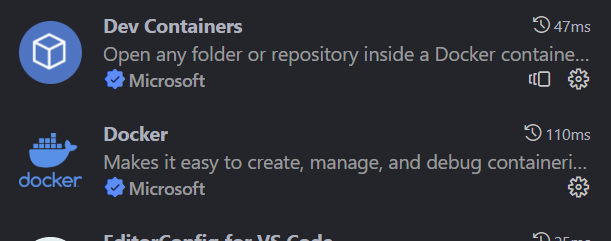
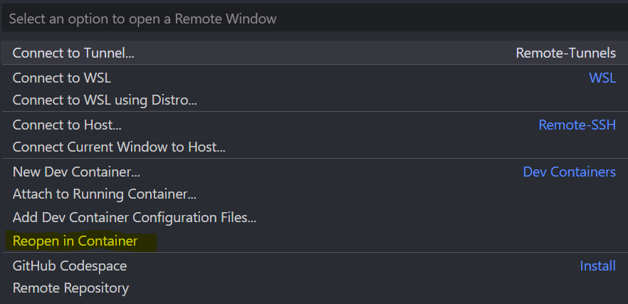
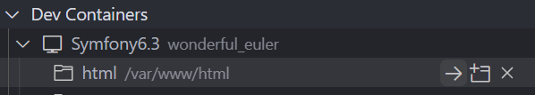
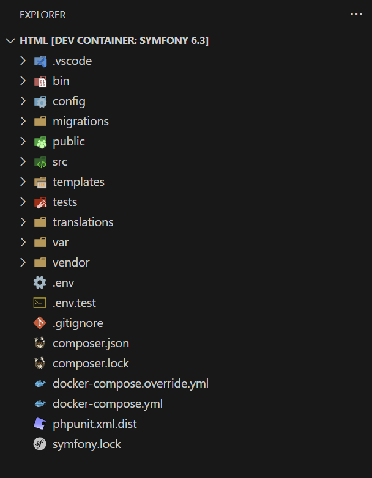
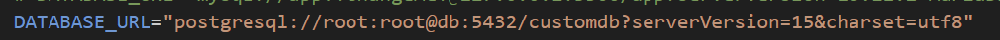

# 🐳 Entorno dockerizado para Symfony.6.4.* 🐳

## Descripción

Este entorno incluye todo lo necesario para desarrollar una aplicación bajo Symfony en un entorno totalmente dockerizado.

## Lo que incluye:

1. **Symfony 6.4.*** -> Se generará un esqueleto con la última versión 6.4 (LTS) de Symfony.
2. **PostgreSQL** -> El SGBD (sistema gestor de base de datos) utilizado.
3. **PHP 8.2** -> La versión de PHP utilizada.
4. **Nginx (Alpine)** -> El servidor web utilizado
5. **NodeJS 18.17.0** -> NodeJS, por si hiciera falta hacer uso en algún momento de el mismo
6. **NPM 9.6.6** -> El gestor de paquetes npm
7. **XDebug 3.2.0** -> El depurador, necesario para depurar el código PHP
8. **Git** -> Instalado (requiere configuración por tu parte para enlazar tu usuario, token, etc)

## Requerimientos previos:

* Tener docker instalado en el equipo

## Instalación:

1. Clonar este repositorio:

   ```
   git clone https://github.com/Fryuio/docker-symfony
   ```
2. Modificar la configuración por defecto en el archivo **.env** (opcional)**:**

   | Variable              | Por defecto   | Descripción                                                                                                          |
   | --------------------- | ------------- | --------------------------------------------------------------------------------------------------------------------- |
   | *POSTGRES_USER*     | *root*      | El usuario que tendrás que usar para conectarte a la base de datos una vez creados y levantados los contenedores     |
   | *POSTGRES_PASSWORD* | root          | La contraseña que tendrás que usar para conectarte a la base de datos una vez creados y levantados los contenedores |
   | *POSTGRES_DB*       | *customdb*  | El nombre de la base de datos que tendrá tu sistema                                                                  |
   | *USER*              | *usuario*   | El nombre de usuario que se generará en el contenedor y será usado para trabajar                                    |
   | *NGINX_DOMAIN*      | *localhost* | El dominio que usará nginx cuando se inicie el servidor web                                                          |
3. Construir el entorno situándonos en la carpeta raíz usando docker compose:

   ```
   docker compose build
   ```
4. Levantar los contenedores una vez construidos:

   ```
   docker compose up -d
   ```
5. Debería funcionar ya el entorno, si entras en **http://NGINX_DOMAIN**
6. Para trabajar, si usas Visual Studio Code, instala las extensiones recomendadas para Docker:

   
7. Una vez instaladas, hay varias opciones:

   7.1 Click abajo izquierda en los símbolos **><**, y, arriba en el menú **Reopen in Container**:

   

   Puede que las opciones se muestren en tu idioma en caso de que hayas instalado previamente algún paquete de idiomas.

   7.2 Si no te aclaras así, puedes en el buscador arriba escribir:

   ```
   >reopen in container
   ```

   Saldrá la opción resaltada, y lo mismo, click para abrir en el contenedor.

   7.3 Y como última opción si con ninguna de las dos anteriores lo consigues, usando la extensión de **dev containers**, click en el icono de **explorador remoto**:

   

   Una vez dentro de la ventana, click en la flecha dónde dice **html**:

   
8. Una vez dentro del contenedor, tendrás el esqueleto de symfony:

   -
9. Es necesario modificar el archivo **.env** con tus datos de base de datos, debería quedarte así (si has usado los datos por defecto, sino, tendrás que modificarlo con los tuyos):

   

## Contacto

[🏢 https://www.linkedin.com/in/antoniogzlezfndz/](Linkedin "Linkedin")

✉️ fryuio98@gmail.com
